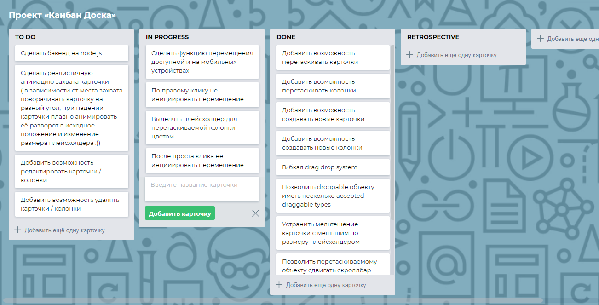

# Kanban board [Frontend]

Simplified Trello clone

**[DEMO](https://tanyaignatenko.github.io/kanban-board/)**

## Features :boom:
 * Add new cards
 * Add new lists
 * Draggable cards
 * Draggable lists
 * Flexible drag drop system
 * Minimum count of dependencies
 * Dragged object can move scrollbars
 * Board can be scrolled by touch and shift
 * No back and forth swap of placeholder and bigger card
 * Support of mobile and tablet devices
 * Accessibility
* **EXTRA: REALISTIC GRAB ANIMATION!**

## Screenshots :camera:


## Development
```
npm start
```
