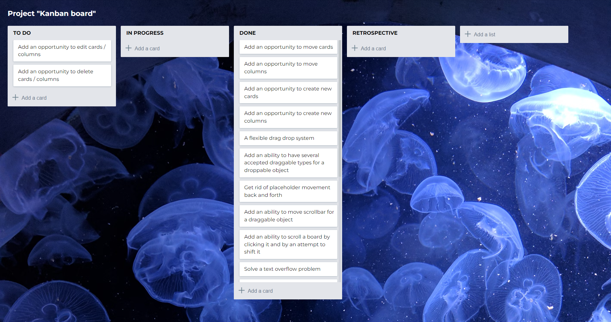

# Kanban board

The goal of the project was to create a Kanban board with a clean maintainable architecture and with a Drag'n'Drop system without using external dependencies.

**Demo: https://tanyaignatenko.github.io/kanban-board/**

Features:
- Ability to create lists
- Ability to create list cards
- Ability to move cards and lists within a board using drag and drop
- Droppable containers can be scrolled by draggable items
- Support for mobile devices
- Custom Drag'n'Drop system without using external dependencies
- Clean and maintainable architecture
- Efficient algorithm for finding the placeholder location of a draggable item

Technologies: React, React hooks, Redux, JavaScript, HTML, SCSS

